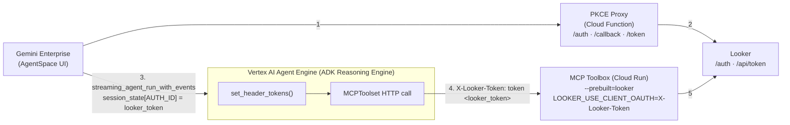

# Looker + Gemini Enterprise via ADK + MCP Toolbox (per-user OAuth)

A working, end-to-end pattern for connecting a **Looker** instance to **Gemini Enterprise** (formerly AgentSpace) via a **Vertex AI Agent Engine ADK agent** that calls the **MCP Toolbox for Databases** with **per-user OAuth** (each user authenticates with their own Looker account, scoped to their own permissions).

This snapshot exists because the official reference implementations and docs are incomplete in several critical ways. Following them as-is will produce silent failures and confusing 401s. The fixes are documented here.

---

## TL;DR — Why this exists

Three independent gotchas blocked us for hours. None are mentioned in any official doc:

1. **Gemini Enterprise's `serverSideOauth2` always sends `client_secret` in the OAuth token exchange.** Looker's CORS OAuth (`/api/token`) is a public PKCE client and rejects requests containing `client_secret` (returns `404 Sinatra::NotFound`). You **cannot** point GE directly at Looker's auth endpoints, despite what the [`lkrdev/looker-oauth-gemini-enterprise`](https://github.com/lkrdev/looker-oauth-gemini-enterprise) reference impl suggests. **You need a PKCE proxy** that absorbs the bogus `client_secret` and does a clean public-client exchange with Looker.

2. **The MCP Toolbox prebuilt mode env var `LOOKER_USE_CLIENT_OAUTH=true` is wrong.** The toolbox actually wants the **header name** to read the user token from, e.g. `LOOKER_USE_CLIENT_OAUTH=X-Looker-Token`. With `true`, the toolbox doesn't know which header to look at and always calls Looker without credentials, producing 401s on every tool call.

3. **You must use `adk deploy agent_engine` CLI, not `agent_engines.create()` / `deploy.py`.** The Python SDK path doesn't register the entrypoint module metadata correctly — sessions handed in from GE (via `streaming_agent_run_with_events`) crash with `RuntimeError: Session initialization failed.` The CLI generates a proper `agent_engine_app.py` wrapper that the runtime understands.

Beyond those three: GE caches OAuth tokens **per user, per authorization resource**, and provides no API to revoke them. If you're iterating, change the `auth_id` to force a fresh consent flow.

---

## Architecture



**Flow:**
1. User clicks chat in Gemini Enterprise. GE checks `agentAuthorization` on the agent, doesn't have a valid token, redirects user's browser to the PKCE proxy `/auth` endpoint. Proxy generates PKCE verifier, redirects to Looker `/auth`. User consents.
2. Looker redirects to proxy `/callback` with auth code. Proxy wraps the code+verifier and redirects back to GE's OAuth redirect URI. GE then POSTs to proxy `/token` with the wrapped code AND its own bogus `client_secret`. Proxy validates the `client_secret` against `PROXY_CLIENT_SECRET`, unwraps the code, exchanges with Looker (no client_secret), returns the access_token to GE.
3. GE POSTs the user message to the Reasoning Engine via `streaming_agent_run_with_events`, including the Looker access token in `request.authorizations`. The ADK template injects it into `session.state[AUTH_ID]`.
4. The agent's `MCPToolset` `header_provider` callback (`set_header_tokens`) reads the token from session state, sets `X-Looker-Token: token <token>` header, and also fetches a GCP ID token for Cloud Run authentication on the toolbox. MCP request goes out.
5. The MCP Toolbox (with `LOOKER_USE_CLIENT_OAUTH=X-Looker-Token`) reads the token from the `X-Looker-Token` header and passes it as the bearer credential when calling Looker's API. Looker authenticates as the **end user**, returns data scoped to that user's permissions.

---

## Primer: PKCE (if you've only done "traditional" OAuth)

If your mental model of OAuth is "server sends `client_id` + `client_secret` on the token exchange" — that's the **confidential client** flavor. PKCE is the **public client** flavor, and it's why this whole proxy exists.

### Why PKCE exists
A confidential client (a backend server) can hold a long-lived `client_secret` safely. A public client (SPA, mobile app, CLI, any browser-driven flow) **cannot** — whatever you ship to the browser is visible to the user. So the OAuth spec defines PKCE (RFC 7636) as the replacement for `client_secret` in those environments.

Instead of a pre-shared secret, the client proves continuity across the two HTTP hops (`/auth` then `/token`) using a one-time value it invents on the spot:

```
code_verifier  = random 43-128 char string            (kept in client memory)
code_challenge = BASE64URL(SHA256(code_verifier))     (sent on /auth)
```

| Step | Traditional OAuth | PKCE |
|---|---|---|
| `/auth` request | `client_id` | `client_id` + `code_challenge` + `code_challenge_method=S256` |
| `/token` request | `client_id` + **`client_secret`** + `code` | `client_id` + **`code_verifier`** + `code` |
| What the IdP verifies | secret matches what's on file | `SHA256(verifier) == challenge` it stored with the code |

The IdP stashes the `code_challenge` next to the authorization code it issued. When the client comes back with the verifier, the server re-hashes it and compares. If they match, the same actor that started `/auth` is the one exchanging at `/token` — no shared secret needed.

### Why Looker's PKCE + Gemini Enterprise don't mix directly
Looker's `/api/token` is a **strict public client** endpoint: it expects `code_verifier`, and it actively **rejects** any request that contains a `client_secret` field (responds `404 Sinatra::NotFound`, which is confusing as hell to debug).

Gemini Enterprise's `serverSideOauth2` authorization resource is built for **confidential clients**: you must configure a `clientId` + `clientSecret`, and GE always sends the secret on the token exchange. There is no "PKCE-only" mode.

Two incompatible assumptions, one HTTP call in the middle. Neither side can be reconfigured. Hence the proxy.

### What the proxy actually does
The proxy is a tiny stateless adapter that runs **two different OAuth conversations at once**:

```
   GE  <—— confidential-client OAuth ——>  Proxy  <—— PKCE public-client OAuth ——>  Looker
         (client_secret validated)                      (code_verifier/challenge)
```

- **Leg A (GE ↔ Proxy):** the proxy *pretends* to be a normal confidential OAuth server. It accepts GE's `client_secret` and validates it against `PROXY_CLIENT_SECRET` (this is the proxy's secret, not Looker's — it exists purely to stop random callers from using the proxy).
- **Leg B (Proxy ↔ Looker):** the proxy is a normal PKCE public client. It generates `code_verifier` + `code_challenge` on `/auth`, and sends the verifier on `/token`. It never forwards a `client_secret` to Looker.

### The stateless trick
A PKCE proxy usually needs storage: the verifier is created on `/auth` but must be remembered until `/token` arrives. That means Redis or a DB and a TTL policy.

This proxy avoids storage entirely by **smuggling the verifier inside values the OAuth protocol already round-trips for you:**

1. On `/auth`, it packs `(original_state, code_verifier)` into the `state` parameter it sends to Looker (base64-encoded JSON). Looker echoes `state` back unchanged on the callback — that's literally what `state` is for — so the verifier comes home for free.
2. On `/callback`, it takes the real authorization code from Looker and packs `(real_code, code_verifier)` into a **new wrapped code** that it hands to GE. GE has no idea this is anything other than an opaque auth code and treats it as such.
3. On `/token`, GE sends the wrapped code back. The proxy unpacks it, recovers `real_code` + `code_verifier`, and does the clean PKCE exchange with Looker.

See `pkce-proxy/main.py:57` (`wrap_code` / `unwrap_code`) — it's ~15 lines of base64url(JSON). No database, no TTL, no state.

One subtlety: GE *also* runs its own PKCE on leg A (it sends `code_challenge` to `/auth` and `code_verifier` on `/token`). The proxy simply ignores GE's PKCE params on leg A. GE's confidential-client `client_secret` check is what we actually validate; its PKCE is ornamental from our perspective, and engaging with it would only add moving parts.

> **Visual walkthrough:** there's an interactive step-by-step version of this flow (sequence diagram + data shapes at each hop + traditional-vs-PKCE diff) published as an artifact — see the link at the bottom of this section after running through the primer.

---

## Repo layout

```
.
├── README.md                         ← you are here
├── adk-agent/                        ← the Vertex AI ADK agent
│   ├── pyproject.toml
│   └── looker_ge_agent/
│       ├── __init__.py               ← exports root_agent
│       ├── agent.py                  ← shim for `adk deploy` (it wants agent.py at package root)
│       └── looker_mcp_agent/
│           ├── __init__.py
│           ├── agent.py              ← the actual ADK agent + set_header_tokens callback
│           └── constants.py          ← env var loading
├── pkce-proxy/                       ← the Cloud Function that bridges GE ↔ Looker PKCE
│   ├── main.py
│   ├── requirements.txt
│   └── deploy.sh
├── toolbox/
│   └── README.md                     ← the toolbox is the prebuilt image; just docs here
├── scripts/                          ← all the deploy/registration steps
│   ├── 00-enable-apis.sh
│   ├── 00-check-prereqs.sh
│   ├── 01-register-looker-oauth-app.sh
│   ├── 02-deploy-pkce-proxy.sh
│   ├── 03-deploy-toolbox.sh
│   ├── 04-register-ge-authorization.sh
│   ├── 05-deploy-adk-agent.sh
│   ├── 06-register-ge-agent.sh
│   └── 99-patch-ge-agent.sh          ← convenience: re-point GE agent to a new RE
└── docs/
    ├── ARCHITECTURE.md               ← deep dive on the auth flow
    ├── TROUBLESHOOTING.md            ← every error we hit + how we fixed it
    └── API-REFERENCE.md              ← exact REST schemas for every Discovery Engine call
```

---

## Setup order (first time)

You'll need: `gcloud` CLI authenticated, a Looker instance with admin access, a GCP project with Vertex AI + Discovery Engine APIs enabled, and a Gemini Enterprise app already provisioned (`engineId`).

Run scripts in order. Each one is idempotent and prints the values you'll need for the next step.

```bash
# 0. Configure your env (one-time)
cp .env.example .env
# Edit .env with your project, looker URL, etc.

# 0a. Enable required GCP APIs
./scripts/00-enable-apis.sh

# 0b. Sanity-check prerequisites (gcloud auth, ADC, uv installed, etc.)
./scripts/00-check-prereqs.sh

# 1. Register an OAuth client app on Looker (one-time per Looker instance)
./scripts/01-register-looker-oauth-app.sh

# 2. Deploy the PKCE proxy Cloud Function (one-time per project)
./scripts/02-deploy-pkce-proxy.sh

# 3. Deploy the MCP Toolbox to Cloud Run (one-time per project)
./scripts/03-deploy-toolbox.sh

# 4. Register the OAuth authorization in Discovery Engine
./scripts/04-register-ge-authorization.sh

# 5. Deploy the ADK agent to Vertex AI Agent Engine
./scripts/05-deploy-adk-agent.sh
# This prints REASONING_ENGINE_ID. Save it to .env.

# 6. Register the ADK agent in Gemini Enterprise
./scripts/06-register-ge-agent.sh

# Done. Open your Gemini Enterprise app and chat with the Looker Agent.
```

For iteration after a code change, just re-run `05-deploy-adk-agent.sh` (creates a new RE) and `99-patch-ge-agent.sh` (re-points GE to it).

---

## Critical configuration values (DON'T copy/paste from the ref impl)

### MCP Toolbox env var
```bash
# WRONG (from most docs and examples):
LOOKER_USE_CLIENT_OAUTH=true

# RIGHT:
LOOKER_USE_CLIENT_OAUTH=X-Looker-Token
```
The value is the **header name** the toolbox should read the per-user OAuth token from, not a boolean flag. The `--prebuilt=looker` mode passes this directly into the `tools.yaml` `use_client_oauth` field, which expects a string.

### Discovery Engine OAuth authorization
```json
{
  "serverSideOauth2": {
    "clientId": "looker-via-proxy",
    "clientSecret": "super-secret-key",
    "authorizationUri": "https://<region>-<project>.cloudfunctions.net/looker-pkce-proxy/auth?response_type=code&scope=cors_api&access_type=offline&prompt=consent",
    "tokenUri": "https://<region>-<project>.cloudfunctions.net/looker-pkce-proxy/token"
  }
}
```

**Notes:**
- `clientId` and `clientSecret` here are the **proxy's** credentials, not Looker's. The proxy validates the secret to prevent random callers from using it.
- `authorizationUri` and `tokenUri` point at the **proxy**, not Looker directly.
- **Do not** set `pkce_verification_enabled: true`. The ref impl recommends it; it doesn't help and may interfere with the proxy's own PKCE handling.
- `prompt=consent` forces a fresh consent screen, useful during development.

### ADK Agent deployment
**Use the CLI, not the Python SDK:**
```bash
# WRONG (from the ref impl deploy.py):
agent_engines.create(adk_app, ...)

# RIGHT:
adk deploy agent_engine --project=PROJ --region=us-central1 --display_name=NAME ./looker_ge_agent
```
The CLI generates a proper `agent_engine_app.py` wrapper. The Python SDK path does not register entrypoint metadata, and GE-initiated sessions crash on initialization.

The agent package needs an `agent.py` at its **root** (not just inside subpackages) — the CLI generates a wrapper that does `from .agent import root_agent`. We satisfy this with a one-line shim:
```python
# looker_ge_agent/agent.py
from .looker_mcp_agent.agent import root_agent
```

### Cross-project IAM
If the toolbox lives in a different GCP project from the Reasoning Engine, grant the RE service account `roles/run.invoker` on the toolbox Cloud Run service:
```bash
gcloud run services add-iam-policy-binding toolbox-oauth \
  --project=<TOOLBOX_PROJECT> \
  --region=us-central1 \
  --member="serviceAccount:service-<RE_PROJECT_NUMBER>@gcp-sa-aiplatform-re.iam.gserviceaccount.com" \
  --role="roles/run.invoker"
```
The RE service account doesn't exist until you've deployed at least one Reasoning Engine in the target project — so do this **after** step 5.

---

## Acknowledgements

The starting point for the ADK agent code came from [`lkrdev/looker-oauth-gemini-enterprise`](https://github.com/lkrdev/looker-oauth-gemini-enterprise). Their `set_header_tokens` callback pattern is correct; the OAuth registration pattern (direct PKCE to Looker) is not. We're working on a PR with the fixes.

The PKCE proxy approach is borrowed from internal experiments on the joon-ai project (`4.pkce-proxy/main.py` in the parent repo).

---

## License

MIT — same as the reference implementation we forked from.
